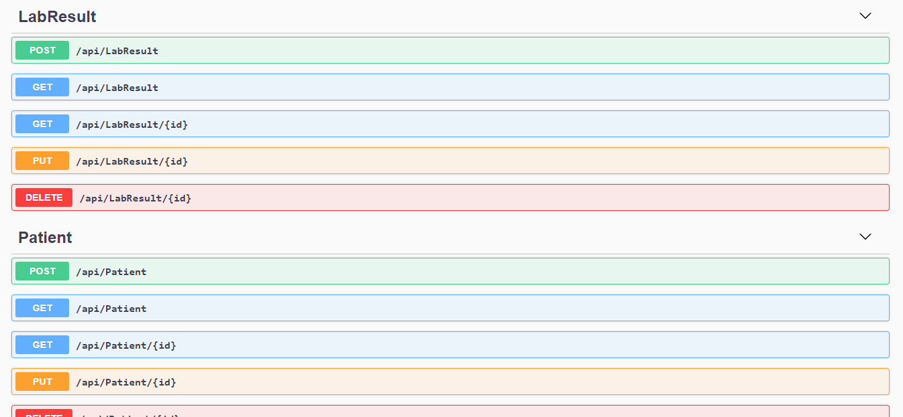
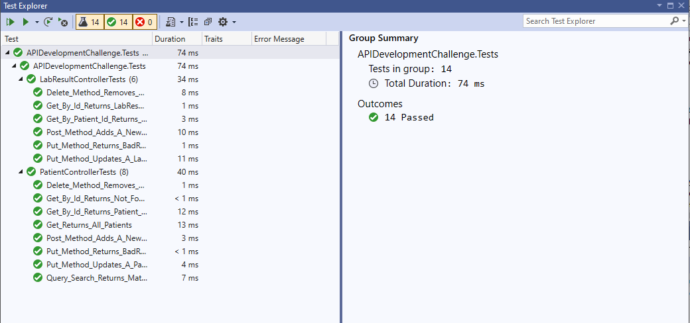

# API Development Challenge
Build a basic lab test API to track patients and their lab results.
## Planning
- I always start an API by creating an [ERD](https://dbdiagram.io/d/60419da7fcdcb6230b22b215), even here with only two tables.
- Even though the tasks detailed the Lab Results controller first, I opted to construct the Patient controller first, due to the dependency of Lab Results on a PatientId.
- The use of in-memory cache was new to me, so I opted to tackle this last. This was so, if I got hung up, it wouldn't prevent me from completing the overall functionality of the API. More on this below.
## Tools
- I set up the project using .NET 5, mainly to save time on Swagger setup
- I used a SQL server for database persistence and to demonstrate my ability to interact with a server in this way
- The only external library I used was Microsoft.Data.SqlClient, to interact with the SQL server
## Setup
Note: you will need a local SQL server to run this API
1. From the command line, run ```git clonegit@github.com:dLars99/api-development-challenge.git``` to clone the repository
2. Open the project in Visual Studio to install dependencies
3. Open the two sql scripts located in the ```SQL``` folder on the project root
4. Run the two SQL scripts in sequence: ```1-Create_Database``` and ```2-Seed_Data```
5. Run the app through the Visual Studio debugger or via ```dotnet run``` in the command line
6. Swagger should open automatically
7. You can test the routes through Swagger, or through another tool such as Postman
8. The least intuitive route is the one to retrieve patient records by test type and datetime range. This one is run at the ```patient/labs``` endpoint with three query parameters: ```query``` string to denote the ```TestType```, and ```startDate``` and ```endDate```, which can be entered in ```mm-dd-yyyy``` format.
### Testing
There are unit tests available for all routes. These can be run from the Test Explorer in Visual Studio, or by typing ```dotnet test``` in the command line
<p>
    
    
</p>

## Did I Try New Things?
Why, yes I did! As mentioned before, this was the first time I worked at all with in-memory cache. I found that, overall, it was not that difficult to implement for the usage of this app, though I am sure there is more power available that I have not yet discovered. I realized only when I reached this point at the end that it could be possible to mock up the full API using the cache. I hope, however, that my use of SQL server for the overall database with caching active in the controllers effectively helps to demonstrate my skills and adaptability.

Although I had done some unit testing previously, this was also my first usage of test-driven development. I feel it was effective in helping to plan the API routes, though it did cause some headaches on a pair of routes where the tests failed when the routes were working!

## Tradeoffs and next steps
- I contemplated creating separate models and tables for some items like insurance information and test types, but decided against it for time's sake. This would be a first next step for me for scalability.
- Along the same lines, I also considered subclasses for reports of different test types.
- There are some routes I wanted to implement that I ran out of time for, like GET by name for patients and a more general get by TestType for lab results.
- I want to implement additional validation for data on the Patient controller: checking for a valid birthdate, making sure all insurance information is either present or null, limiting the options for SexAtBirth.
- I have no doubt that there is code that could be refactored for DRYness and readability.

